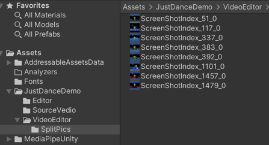
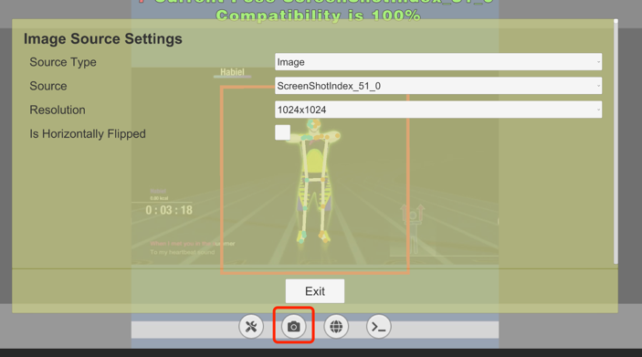
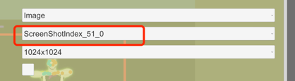
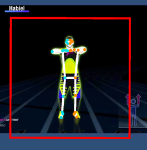
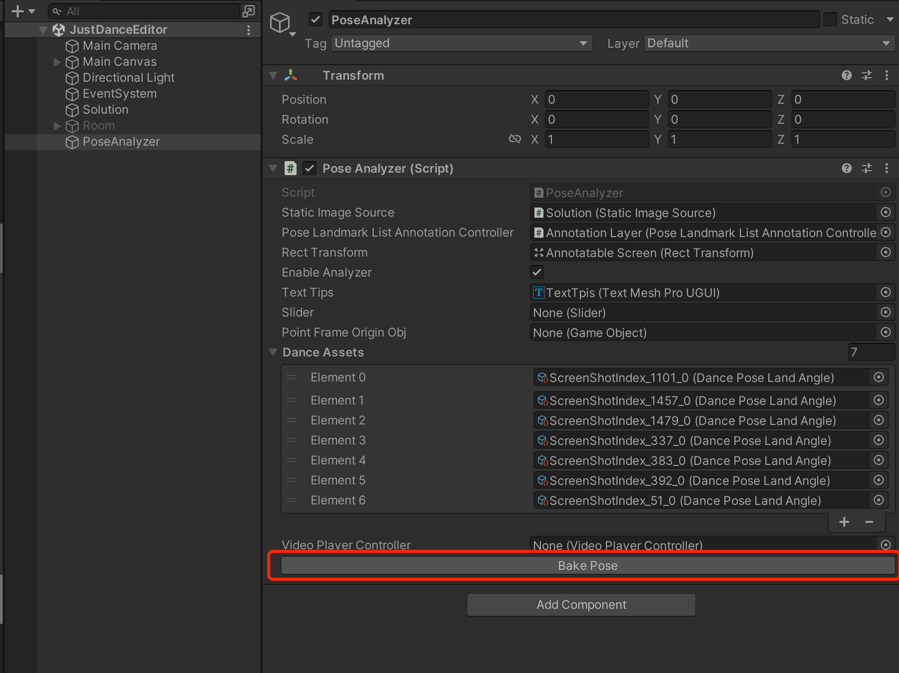
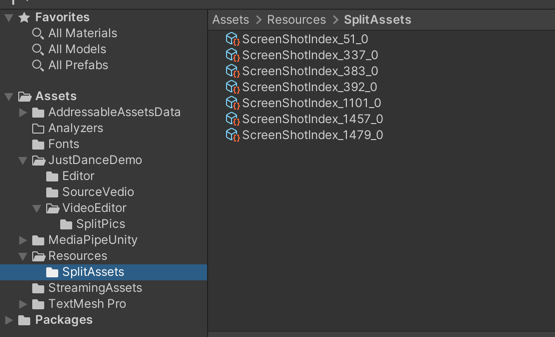
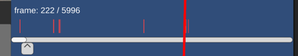
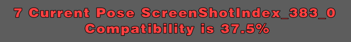
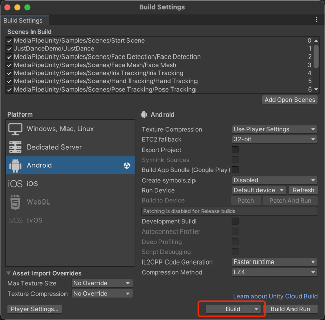

##JustDacneDemo

谷歌浏览器 方便查看 markdown : https://www.jianshu.com/p/f50d670972fb

#编辑器相关
* 1 打开 JustDance 场景 运行
* 2 按K键录制视频某一帧作为识别图片
* 3 查看目录文件想对应图片是否被存储

* 
* 4 运行 JustDanceEditor 场景
* 5 打开摄像机设置
* 
* 选择需要识别的图片 然后 按 exit
* 
* 等待 姿势被识别
* 
* 此时找到烘焙动作按钮 点击(一定要在运行时)
* 
* 完成后找到录制的资源 名字对应录制完成
* 

如需要重新录制 SplitAssets路径下的可删除 不影响
重复录制同一帧会覆盖资源

#运行demo

打开 JustDance 场景 运行

 右下进度条显示 录制的帧所占争端视频的位置

左上角显示 对比的pose的匹配度

#打包相关
*使用的unity版本为 2021.3.4f1 或者 2021.3.4f1c1

#切换安卓平台经常打包即可 所有设置已经有初始值

